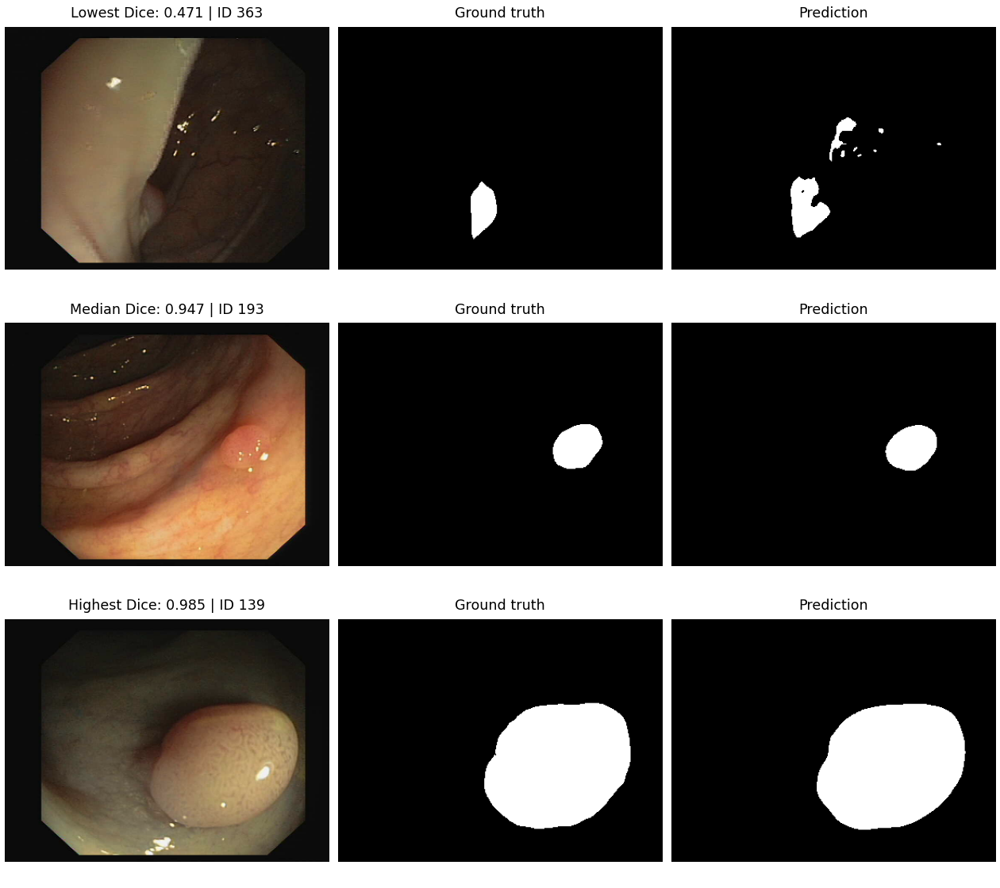
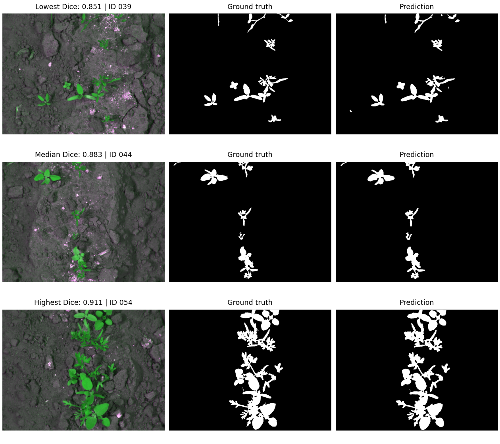

# MK-UNet student screening study

[](https://github.com/tasnimuldatascience/mk-unet-screening-study/actions/workflows/verify.yml)

End-to-end implementation of the student screening brief: one reference
experiment, one new-domain experiment, an execution summary, a three-page technical
report, and a six-page research proposal. The proposal is a planned research study;
it does not claim that its proposed adaptation algorithm has been tested.

Completed held-out results: ClinicDB Dice 91.28%, IoU 85.19% (n=62); CWFID
Dice 87.98%, IoU 78.59% (n=21). These are single-seed results.

## Read the results

- [Experimental execution summary](output/pdf/experimental_execution_summary.pdf)
- [Technical report](output/pdf/technical_report.pdf)
- [Research proposal](output/pdf/research_proposal.pdf)
- [Machine-readable results](output/results_summary.json)
- [Protocol audit](sources/protocol_audit.md) explains reproducibility differences and limitations.

PDFs are generated only after both 200-epoch experiments complete. Actual metrics
are read from run evidence, never inserted as assumed baseline values.

## Environment

Tested on Windows, Python 3.13, PyTorch 2.11.0+cu128, and an RTX 5070 Laptop GPU.
The local `.venv` inherits the existing CUDA PyTorch installation. A fresh machine
should install a compatible GPU PyTorch build before the remaining requirements.
CPU execution is supported but will be slower.

```powershell
python -m venv .venv
./.venv/Scripts/python.exe -m pip install torch==2.11.0 torchvision==0.26.0 --index-url https://download.pytorch.org/whl/cu128
./.venv/Scripts/python.exe -m pip install -r requirements.txt
```

Exact observed package versions are recorded in `sources/environment.lock.txt`.
That file includes the host environment's inherited packages and is an audit
snapshot, not the minimal install specification.

## Acquire and validate data

The official MK-UNet repository is retained at `vendor/MK-UNet` with its BSD license.
On a fresh checkout, acquire the pinned dependencies with:

```powershell
git clone https://github.com/SLDGroup/MK-UNet.git vendor/MK-UNet
git -C vendor/MK-UNet checkout 2fa8b230a057602539af7655203ad434bf56a5b6
git clone https://github.com/cwfid/dataset.git data/raw/cwfid
git -C data/raw/cwfid checkout 36290d0912a032f0bd1a5678ed55457ddafde217
./.venv/Scripts/python.exe scripts/download_clinicdb.py
./.venv/Scripts/python.exe scripts/prepare_colondb.py
```

Google Drive can fail partway through the download. The saved Drive index contains
the authors' complete split. The fallback downloads a public archive, verifies
every already-downloaded image/mask pixel-for-pixel, and fills missing files using
that same index:

```powershell
./.venv/Scripts/python.exe scripts/restore_clinicdb_mirror.py
./.venv/Scripts/python.exe scripts/prepare_data.py all
```

The observed fallback verified 454 overlapping files and restored 770 files.
Archive hash and source URL are in `sources/clinicdb_mirror_audit.json`.
The ClinicDB split is 489/61/62 images. CVC-ColonDB contributes 380 sealed
external-test images and is never used for tuning. CWFID has 31/8/21 after excluding
training/test overlap at ID 028 and reserving validation from training only.
Native CWFID masks encode vegetation as black; the manifest records explicit
foreground inversion. No image IDs or image hashes may cross splits.

Data are for research use. Preserve the original ClinicDB and CWFID terms and
citations. Do not redistribute the downloaded images as part of an unrestricted
software release.

See [data availability](docs/data-availability.md) for fixed dataset roles, sources,
and leakage controls. The proposal's adaptation method has a tested controller
prototype in `screening/risk_controller.py`; integration experiments remain planned.

## Train and evaluate

Run from this project root. Execute these sequentially on an 8 GB GPU:

```powershell
./.venv/Scripts/python.exe -m screening.run train --config configs/clinicdb_reference.json
./.venv/Scripts/python.exe -m screening.run train --config configs/cwfid_domain.json
```

The reference follows the paper's stated 200 epochs, three image scales, standard
channels, no augmentation, AdamW 1e-4, and batch 16. CWFID uses batch 8 and the same
architecture trained from scratch. Both use seed 42. This is a single-seed
replication attempt, not verification of the publication's five-run mean.
ClinicDB uses float16 mixed precision with gradient scaling to fit batch 16 in
8 GB VRAM; CWFID uses FP32. This is an explicitly recorded numerical deviation.

Resume an interrupted run without changing its configuration:

```powershell
./.venv/Scripts/python.exe -m screening.run train --config configs/clinicdb_reference.json --resume
```

Validation selects `best.pt`; the test set is evaluated after selection. Checkpoints
contain model/optimizer/RNG state. Changing the configuration or manifest blocks
resume. Use a different output directory for a new seed/configuration.

Re-evaluate a saved checkpoint:

```powershell
./.venv/Scripts/python.exe -m screening.run evaluate --checkpoint runs/clinicdb_reference_seed42/best.pt --manifest data/manifests/clinicdb.json --output runs/clinicdb_reference_seed42/recheck
```

The primary metric uses per-image min-max normalized probabilities and a 0.5
threshold, following upstream postprocessing. A second result uses raw sigmoid
probability threshold 0.5. Ground truth remains at native resolution. Dice/IoU are
macro-averaged over images. Both-empty masks score 1. Bootstrap intervals are
image-level, conditional on one fitted model, and do not quantify between-site or
training-seed variability.

## Predictions and diagnostic stress tests

```powershell
./.venv/Scripts/python.exe -m screening.predict --checkpoint runs/cwfid_domain_seed42/best.pt --image data/raw/cwfid/images/001_image.png --output output/example_prediction
./.venv/Scripts/python.exe scripts/robustness.py --run runs/cwfid_domain_seed42
```

Prediction writes native-resolution binary masks, raw probabilities, and an overlay.
The optional stress test runs fixed brightness, blur, and noise conditions without
training or target-label adaptation. It is not the novel method proposed in Step 2.

## Verify and rebuild deliverables

```powershell
./.venv/Scripts/python.exe -m unittest discover -s tests -v
./.venv/Scripts/python.exe scripts/build_deliverables.py
./.venv/Scripts/python.exe scripts/verify_deliverables.py
```

`build_deliverables.py` is the editable source for the report and proposal.
The verification script checks PDF page counts, run completion, finite metrics,
checkpoint hashes, and CSV consistency; it also renders PDFs for visual review.

## Evidence layout

```text
configs/                 Explicit experiment configurations
data/manifests/           Split membership and image/mask SHA-256 hashes
screening/               Dataset, model adapter, loss, training, metrics, inference
scripts/                 Acquisition, validation, robustness, document generation
tests/                   Data-integrity and evaluation regression tests
runs/<experiment>/
  provenance.json        Configuration, data/model hashes, upstream commit, hardware
  history.jsonl          Per-epoch training loss, validation scores and wall time
  best.pt / last.pt      Selected model / resumable training state
  metrics.json           Final held-out scores and checkpoint identity
  test/per_image.csv     Per-image Dice, IoU and confusion counts
  test/predictions/      Native-resolution masks
sources/                 Audit, environment snapshot and captured run logs
output/pdf/              Final report documents
```

## Published package

The experiment summary, technical report, research proposal, code, configurations,
manifests, and machine-readable results are published in this repository. Versioned
PDF files are attached to the [GitHub release](https://github.com/tasnimuldatascience/mk-unet-screening-study/releases/tag/v1.0.0).

## Qualitative results

Each panel shows the input image, reference mask, and model prediction for low,
median, and high Dice examples from the held-out test set.

| ClinicDB | CWFID |
|---|---|
|  |  |

## References

- Rahman and Marculescu, MK-UNet, ICCV Workshops 2025: https://arxiv.org/abs/2509.18493
- Original code: https://github.com/SLDGroup/MK-UNet
- CWFID: https://github.com/cwfid/dataset and https://doi.org/10.1007/978-3-319-16220-1_8
- ClinicDB: Bernal et al., WM-DOVA maps for accurate polyp highlighting in colonoscopy, CMIG 43 (2015), 99-111.
